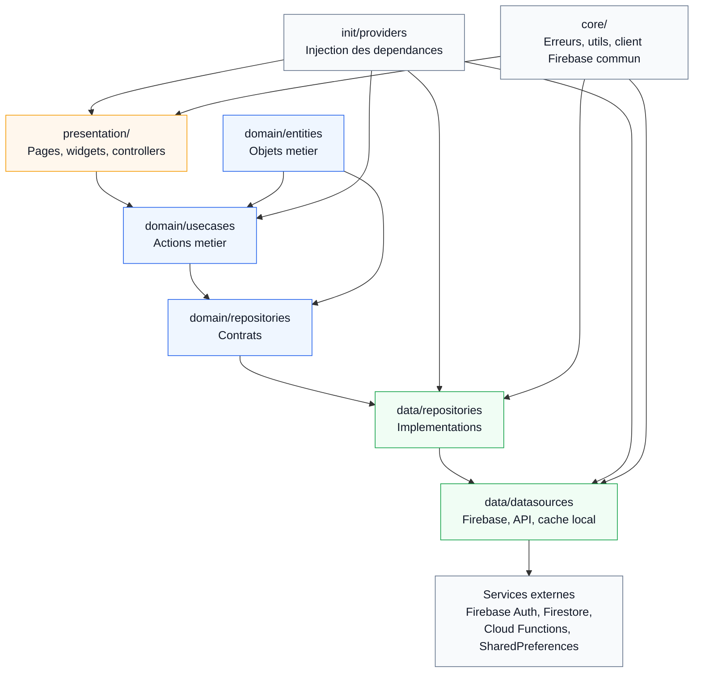

# Architecture Clean - Vue globale

L'application est organisee avec une Clean Architecture par fonctionnalite.
Chaque feature est rangee dans `lib/features`, puis separee en trois grandes couches:

```text
lib/
  core/
  init/
  presentation/
  features/
    nom_de_la_feature/
      client/
        presentation/
        domain/
        data/
      admin/
        presentation/
        domain/
        data/
```

## Schema global



## Explication simple

La couche `presentation` contient ce qui est visible dans l'application: les pages, les widgets et les controllers. Elle ne doit pas porter toute la logique metier, elle appelle plutot les use cases.

La couche `domain` contient le coeur metier de chaque feature. On y trouve les `entities`, les `usecases` et les contrats de `repositories`. Cette couche explique ce que l'application sait faire, sans dependre directement de Firebase ou de l'interface.

La couche `data` contient les implementations concretes. C'est ici que les repositories appellent les datasources, et que les datasources parlent avec Firebase, les Cloud Functions, Firestore ou le cache local.

Le dossier `init/providers` sert a brancher les dependances. Il construit les datasources, les repositories, les use cases et les controllers, puis les injecte dans l'application avec `Provider`.

Le dossier `core` contient le code commun reutilisable par plusieurs features: gestion des erreurs, outils, client Firebase commun, helpers transverses.

En resume, le sens principal est:

```text
presentation -> domain -> data -> services externes
```

Chaque fonctionnalite suit cette meme structure de dossiers.
